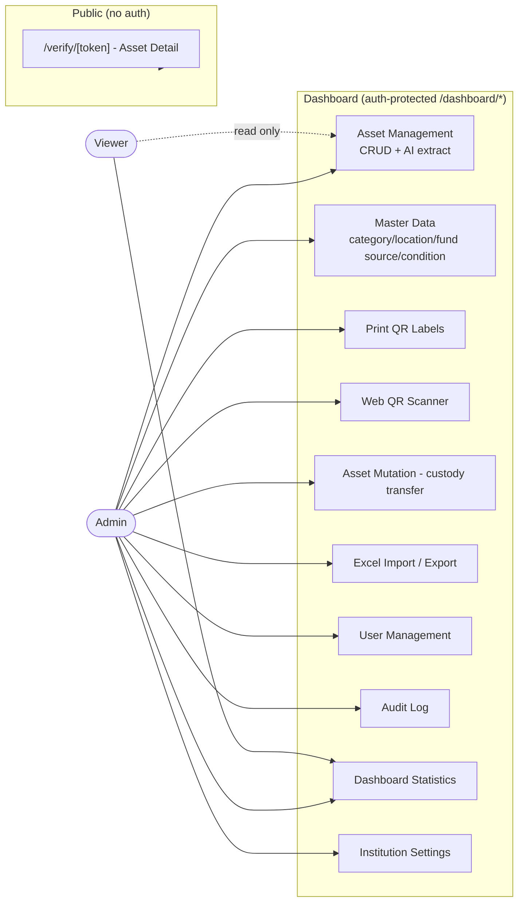
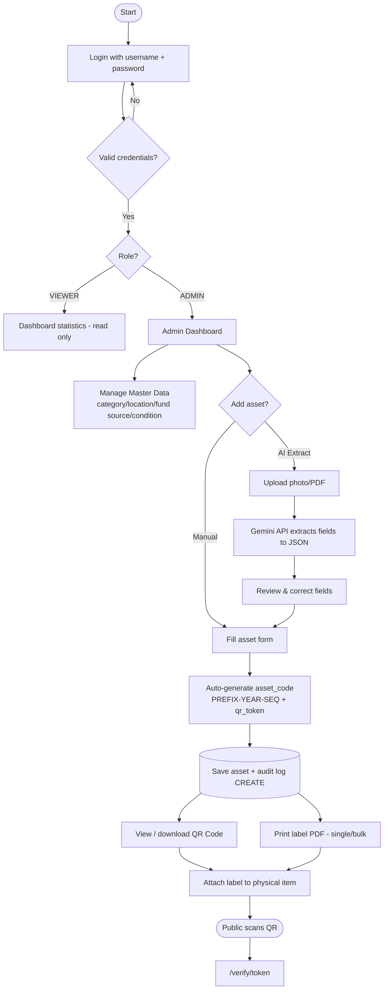
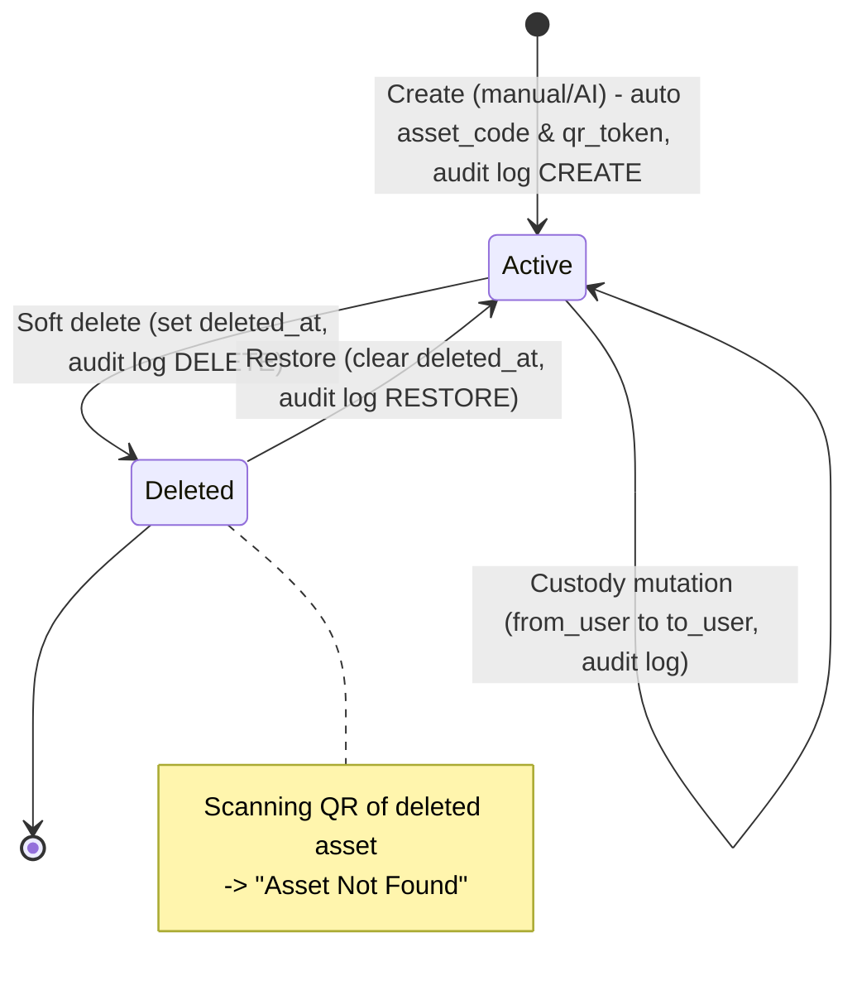
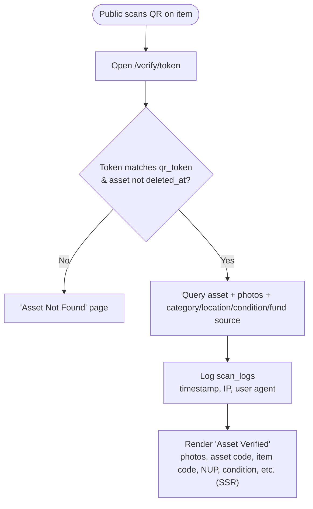
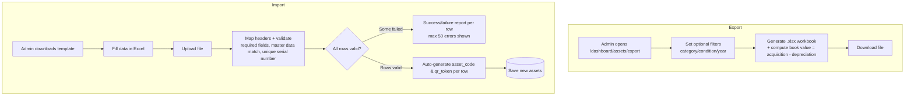

# Business Process Diagrams — InvenTrack (Existing)

This document describes the business processes **already implemented** in InvenTrack (not a proposal/future plan), based on `PRD.md`, `prisma/schema.prisma`, and the Server Actions implementation in `src/actions/`.

Actors:
- **Admin** — full access (asset CRUD, master data, users, labels, import/export, mutations, audit log, settings).
- **Viewer** — read-only (dashboard, view asset list/detail).
- **Public** — scan QR, no login, only sees the verification page.

Note: the system has **no multi-stage approval workflow** (no pending/approved status). Data change control relies on soft-delete + restore and per-field audit logging.

---

## 1. Actor & Module Map

---

## 2. Main End-to-End Flow

---

## 3. Asset Lifecycle (Create → Edit → Mutation → Delete → Restore)

---

## 4. Public Verification Flow (QR Scan)

---

## 5. Excel Import / Export Flow

---

## Data Control Summary

- **No tiered approval** — every admin action takes effect immediately.
- **Audit trail** (`audit_logs`): every CREATE/UPDATE/DELETE/RESTORE on assets & mutations is logged with actor + old→new field diff.
- **Soft delete** (`deleted_at`) on `assets` and `users` — data is never permanently lost, can be restored via Trash.
- **Scan tracking** (`scan_logs`) — every public QR scan is logged (not an approval, observability only).
